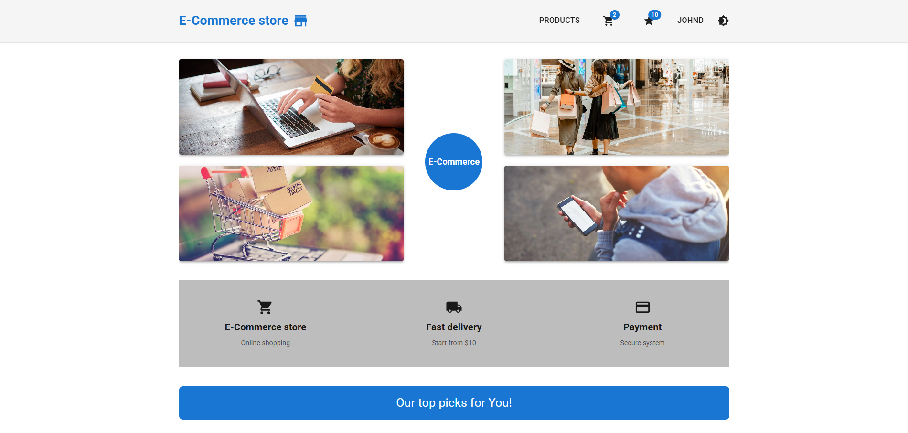
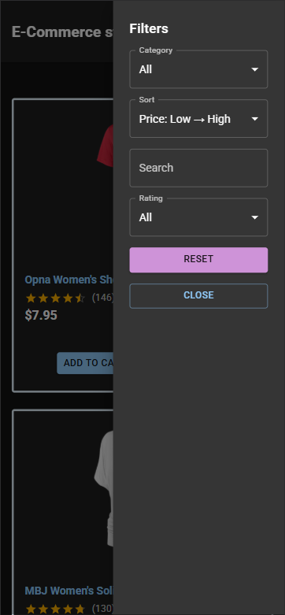
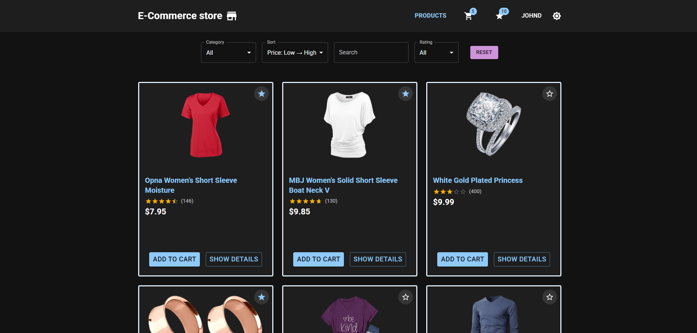
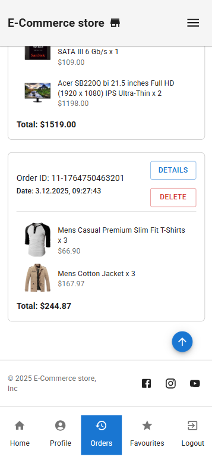
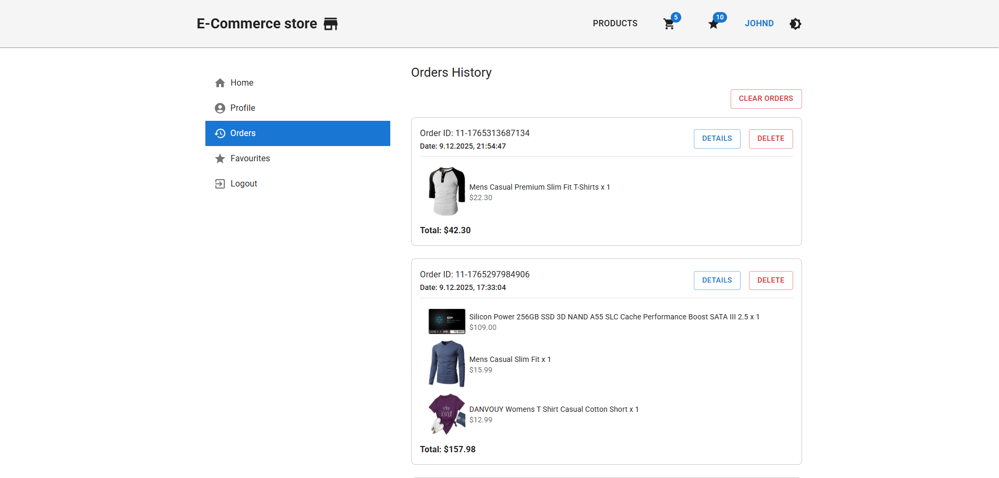

# 🏪 E-Commerce-store

Aplikacja e-commerce została stworzona w ramach kursu JavaScript Developer, moduł specjalistyczny. Projekt ma na celu odwzorowanie funkcjonalności popularnych sklepów internetowych, pozwalając użytkownikom na intuicyjne przeglądanie, wybieranie i zakup produktów.

**Dostępna online:**  
[https://e-commerce-store-online.netlify.app/](https://e-commerce-store-online.netlify.app/)

---

⚠️ **Informacje o API (Uwaga dla reviewerów)**
Aplikacja korzysta z Fake Store API, które pełni rolę backendu demonstracyjnego.
Dane są symulowane i nietrwałe – np. koszyk czy logowanie resetują się po odświeżeniu strony.

Nie wszystkie endpointy API są wykorzystywane — integracja obejmuje te potrzebne do zakresu funkcjonalności (produkty, logowanie, koszyk).

API służy wyłącznie celom edukacyjnym i testowym.

---

⚙️ Uwagi dotyczące środowiska Docker i node_modules

Projekt był rozwijany i testowany na WSL2, gdzie Docker działa na natywnym systemie plików Linux (ext4).

W tym środowisku zastosowano bind mounty bez użycia anonimowych wolumenów dla `node_modules`, 
ponieważ przy WSL2 + ext4 nie powoduje to problemów wydajnościowych, a zapewnia:

- pełny dostęp do `node_modules` z poziomu VS Code (IntelliSense, Go to Definition),
- łatwiejsze debugowanie bibliotek,
- spójne uprawnienia plików (UID 1000),
- prostszą konfigurację środowiska developerskiego.

Na macOS oraz Windows (bez WSL2), gdzie Docker działa na maszynie wirtualnej i korzysta z systemów plików
NTFS/APFS, zalecane jest użycie osobnego wolumenu Docker dla `node_modules` ze względu na koszt synchronizacji
pomiędzy hostem a kontenerem.

---

## 🚀 Najważniejsze funkcje

- Integracja z Fake Store API do uwierzytelniania użytkownika oraz pobierania danych o produktach
- Obsługa motywów: jasny i ciemny
- System logowania użytkownika
- Przeglądanie katalogu produktów z możliwością filtrowania i sortowania
- Zarządzanie koszykiem użytkownika
- Zarządzanie ulubionymi produktami
- Finalizacja zakupów z wyborem metody płatności i dostawy
- Pulpit użytkownika wraz z historią zamówień dostępny w sesji użytkownika

---

## 🛠️ Wykorzystywane technologie

- React – do tworzenia skalowalnych i wielokrotnego użytku komponentów UI
- React-Router – do zarządzania nawigacją między komponentami bez przeładowania strony
- TanStack Query (React Query) – do zarządzania stanem danych z API, cache'owania i synchronizacji
- Redux Toolkit – do globalnego zarządzania stanem aplikacji (sesja użytkownika, koszyk, historia zamówień, filtry, ulubione produkty)
- React Hook Forms – do tworzenia formularzy
- Zod - do walidacji formularzy
- MUI (Material-UI) – do budowy spójnego, responsywnego i estetycznego interfejsu
- React-Toastify – do wyświetlania powiadomień i obsługi błędów w interfejsie
- Podejście Mobile-First
- Narzędzia testowe:
  - Vitest – testy jednostkowe
  - React Testing Library – testy komponentów
  - MSW – przechwytywanie żądań do Fake Store API i zwracanie przygotowanych odpowiedzi
  - Playwright – testy end-to-end (E2E), zintegrowane z GitHub Actions (CI)
  - Fake Store API – do symulacji działania backendu dla produktów i transakcji
- Docker – do konteneryzacji aplikacji w środowisku deweloperskim, testowym i produkcyjnym

---

## 📸 Zrzuty ekranu

Mobile i desktop znajdują się w folderze `app/src/screenshots/`.

### Widok 1



### Widok 2



### Widok 3



---

## ⚙️ Szczegółowe funkcjonalności

### ☀️🌙 1. Obsługa motywów

Użytkownicy mogą płynnie przełączać się między jasnym, a ciemnym motywem, zapewniając czytelność i dostępność UI.

### 🔐 2. Uwierzytelnianie użytkowników

Logowanie odbywa się poprzez endpoint Fake Store API - POST:

```bash
Autoryzacja - POST `/auth/login`
Id użytkwonika wybranego po username - GET `/users`
Dane użytkownika wybrane po id oraz tokenie - GET `/users/:id`
```

Dane logowania testowego:

```bash
username: "johnd"
password: "m38rmF$"
```

API zwraca token JWT (symulowany) i jest zapisywany w lokalnej pamięci przeglądarki (localStorage).
Token zawiera poprawny format JWT, ale nie ma walidacji bezpieczeństwa — jest generowany wyłącznie do celów demonstracyjnych.

### 📦 3. Katalog produktów

Wykorzystywane endpointy:

```bash
Pobranie listy produktów — GET `/products`
Pobranie jednego produktu — GET `/products/:id`
Pobranie kategorii — GET `/products/categories`
Produkty w kategorii — GET `/products/category/:category`
Sortowanie produktów po cenie — GET `/products?sort=desc`
```

Ograniczenie API: maksymalnie 20 produktów.
Produkty są prezentowane ze zdjęciami, opisami, cenami, ocenami i kategoriami. Aplikacja obsługuje filtrowanie, sortowanie i wyszukiwanie. Produkty ładowane są metodą lazy-loading.

### 🛒 4. Koszyk

Koszyk działa w całości po stronie frontendu. Dane koszyka są przechowywane w localStorage, dzięki czemu pozostają po odświeżeniu strony, ale nie są trwałe po stronie serwera — backend ich nie zapisuje.

Wysłanie zamówienia zwraca jedynie symulowane ID oraz datę servera poprzez endpoint:

```bash
Wysłanie zamówienia - POST: `/carts`
```

### 🛍️ 5. Proces realizacji zakupów

Ze względu na brak trwałości danych proces realizacji zakupów jest w całości lokalnie. Jedyne id zamówienia oraz data pochodzi z API po wysłaniu zamówienia POST na endpoint `/carts`. Użytkownik przechodzi przez wszystkie etapy: logowanie, podanie adresu wysyłki, wybór metody dostawy, wybór metody płatności i potwierdzenie zamówienia.

### 📑 6. Pulpit użytkownika

Historia zamówień zapisywana jest w sesji użytkownika dzięki redux-toolkit oraz localStorage.

### ⚠️ 7. Obsługa błędów API i powiadomień

Aplikacja obsługuje błędy pochodzące z zapytań HTTP (statusy 4xx i 5xx) oraz inne nieoczekiwane problemy. Mechanizm działa w oparciu o hook useHandleApiError, który:

- Automatycznie wyświetla toast z komunikatem dla użytkownika (react-toastify) w przypadku:
  - Błędu sieciowego (np. brak połączenia)
  - Błędów klienta (4xx)
  - Błędów serwera (5xx)

Pozwala na opcjonalny refetch danych po błędach serwera (5xx) poprzez invalidation React Query.

Zapewnia spójne i nieinwazyjne komunikaty wizualne w całym interfejsie użytkownika, bez powtarzania logiki w poszczególnych komponentach.

Przykładowe użycie w komponencie:

const handleApiError = useHandleApiError(['products-infinite']);

```bash
useEffect(() => {
  if (isError) {
    handleApiError(error);
  }
}, [isError, error, handleApiError]);
```

Dzięki temu użytkownik od razu otrzymuje informację o problemie, a dane mogą zostać automatycznie pobrane ponownie, jeśli wystąpił błąd serwera.

## 🔧 Uruchomienie aplikacji

Aplikację można uruchomić lokalnie lub za pomocą Dockera. W obu przypadkach pierwszym krokiem jest przygotowanie repozytorium.

### 1. Przygotowanie (Wspólne dla obu metod)

1. Utwórz folder `E-Commerce-store`.

2. Sklonuj repozytorium:

```bash
 # SSH (zalecane, jeśli masz skonfigurowany klucz SSH)
git clone git@github.com:Your-Account/E-Commerce-store.git

 # LUB HTTPS
git clone https://github.com/Your-Account/E-Commerce-store.git
```

> Uwagi:

> - SSH pozwala na push/pull do repozytoriów publicznych i prywatnych bez podawania loginu i tokenu, jeśli w kontenerze lub lokalnym systemie masz skonfigurowany klucz SSH.

> - HTTPS wymaga podania tokenu przy operacji push, nawet jeśli repozytorium jest publiczne, jeżeli pracujesz w środowisku, które nie pamięta danych uwierzytelniających (np. w kontenerze Docker).

> - Jeśli korzystasz z HTTPS, upewnij się, że masz skonfigurowany Git Credential Manager lub inny credential helper do przechowywania tokenów.

> - W lokalnym systemie Git mógł wcześniej korzystać z zapamiętanych poświadczeń (credential helper), dlatego operacja push działała bez pytania o token. W kontenerze Docker te ustawienia nie są dostępne, dlatego Git ponownie prosi o token przy operacjach push/pull wykonywanych przez HTTPS.

> - Dla repozytorium publicznego operacje clone i pull działają zarówno przez HTTPS, jak i SSH bez uwierzytelnienia. Różnica staje się istotna przy pracy z repozytoriami prywatnymi, gdzie uwierzytelnienie jest wymagane przy każdej operacji (clone, pull, push), oraz przy operacji push do repozytorium publicznego: HTTPS wymaga wtedy podania tokenu, natomiast SSH opiera się na autoryzacji kluczem.

## 🔐 Autoryzacja Git w kontenerze (HTTPS)
Jeśli używasz HTTPS i Git w kontenerze pyta o dane logowania:
 - Jako hasła użyj swojego Personal Access Token (PAT) z GitHub.
 - Aby uniknąć ciągłego wpisywania danych, możesz włączyć tymczasowy cache w kontenerze:
```bash
git config --global credential.helper 'cache --timeout=3600'
```

3. Wejdź do katalogu:

```bash
   cd E-Commerce-store
```

### 💻 2. Metoda lokalna (Host)

Wymaga zainstalowanego Node.js na Twoim komputerze.

```bash
   npm install     # Instalacja zależności
   npm run dev     # Uruchomienie serwera dev (Vite)
```

→ Aplikacja działa tylko lokalnie na hoście pod http://localhost:3000

Budowanie wersji produkcyjnej (opcjonalnie)\*\*

```bash
   npm run build
```

### 🐳 3. Uruchomienie i obraz Docker oraz środowisko developerskie

Konteneryzacja zapewnia gotowe środowisko bez konieczności instalacji Node.js na hoście.

Start środowiska developerskiego w katalogu głównym projektu:

```bash
 chmod +x startdev.sh  # nadaj uprawnienia (tylko za pierwszym razem)
./startdev.sh
```

> ⚠️ WAŻNE: 
 > - Przy pierwszym uruchomieniu terminala w WSL/Dev Container może pojawić się prośba o podanie hasła do systemu /Linux/Unix/WSL.
 > - Jest to normalne i wynika z nadania uprawnień do wykonywania skryptu i konfiguracji środowiska. 
 > - Hasło podaje się tylko raz – przy kolejnych uruchomieniach kontenera nie będzie wymagane.

Polecenie npm run dev działa tylko lokalnie na hoście, nie w kontenerze, ponieważ port 3000 w kontenerze jest już zajęty.
Frontend w kontenerze (e-commerce-store) uruchamia się automatycznie i jest dostępny w przeglądarce pod adresem:

```bash
http://localhost:3000
```
Teraz jesteś w terminalu kontenera i możesz uruchomić:

```bash
npm install     #  Instalacja zależności (konieczna tylko za pierwszym razem, potem opcjonalnie można doinatalować nowe paczki)
npm run dev     # start serwera developerskiego
```

W środowisku deweloperskim aplikacja działa pod adresem:

```bash
http://localhost:3000
```

W środowisku produkcyjnym (w obrazie Dockerowym) Nginx wystawia aplikację pod adresem:

```bash
http://localhost:8080
```

Zatrzymanie środowiska
Po zakończeniu pracy wystarczy:

```bash
docker compose down
```

Zatrzymanie środowiska
Po zakończeniu pracy wystarczy:

```bash
docker compose down
```

- Dzięki temu, że w docker-compose.yml wolumeny są zdefiniowane jako bind mounty na WSL2, polecenie down usuwa tylko kontenery (system operacyjny, przeglądarki), ale pozostawia Twój kod źródłowy i folder node_modules bezpiecznie na dysku (EXT4).
- Przy kolejnym uruchomieniu ./startdev.sh, Docker użyje istniejących plików, co eliminuje konieczność ponownej instalacji zależności.

### 🧪 Testy i jakość kodu

Projekt posiada zautomatyzowane testy jednostkowe, integracyjne oraz E2E, a także mechanizmy kontroli standardów kodu.

1️⃣ Testy jednostkowe i integracyjne

Uruchamiają się za pomocą Vitest:

```bash
npm test        # uruchamia wszystkie testy jednostkowe i integracyjne
npm run coverage # uruchamia testy z raportem pokrycia
```

---

2️⃣ Testy end-to-end (E2E) z Playwright

Do testów E2E możesz wykorzystać wersję z UI (Trace Viewer) lub CI:

### 🔍 Lokalnie (z UI Trace Viewer)

Uruchamia graficzny interfejs Playwrighta, przydatny do debugowania:

```bash
npm run e2e # wersja z interfejsem graficznym (Trace Viewer)
```

- Komenda ta uruchamia testy w trybie UI (z okienekami).
- Wyniki testów zostaną zapisane w folderze app/test-results/ oraz app/playwright-report/.

Działa tylko lokalnie — poza Dockerem.

### 🐳 W kontenerze Docker (zalecane)

Testy E2E w kontenerze wymagają działającego kontenera frontendowego, dlatego port 3000 musi być dostępny dla przeglądarki i kontenerów testowych.

```bash
docker compose up -d e-commerce-store # Uruchomienie kontenera frontendowego
docker compose exec -it e-commerce-store bash # Wejście do kontenera jako standradowy użytkownik node
```

1. Uruchom środowisko developerskie:

```bash
chmod +x startdev-e2e.sh  # nadaj uprawnienia (tylko za pierwszym razem)
./startdev-e2e.sh
```

- Skrypt uruchamia kontener e2e-tests.
  - Dzięki depends_on, jeśli kontener frontendowy (e-commerce-store) nie działa, zostanie również uruchomiony.
  - Kontener frontendowy pozostaje aktywny dzięki tty: true, więc nie zakończy się samoczynnie.
  - Kontener E2E jest uruchamiany jako Twój użytkownik (UID 1000) – nie root. Obraz Playwright zawiera już wszystkie wymagane biblioteki i przeglądarki (pełne prawa zapisu do cache i trace’ów).

Skrypt automatycznie wykona dla Ciebie:

```bash
docker compose up -d e2e-tests # Uruchomienie kontenera dla testów E2E
docker compose exec -it e2e-tests bash # Wejście do kontenera jako użytkownik ubuntu (UID 1000)
```

2. Teraz jesteś w terminalu kontenera i możesz uruchomić:

```bash
npm run test:e2e-ci # uruchamia testy E2E w trybie CI (bez UI) - wszystko działa jako zwykły użytkownik
```

- Komenda ta uruchamia testy w trybie headless (bez okienek)
- Wyniki testów zostaną zapisane w folderze app/test-results/

ℹ️ Obraz Playwright (mcr.microsoft.com/playwright:v1.57.0-noble) ma już wbudowane wszystkie przeglądarki i zależności systemowe, więc nie trzeba nic instalować ani przełączać się na root.

🛡️ Ważna uwaga dotycząca uprawnień (Non-Root)
W przeciwieństwie do standardowych konfiguracji, w tym projekcie testy E2E nie są uruchamiane jako root.
Dlaczego to jest lepsze?
 - Spójność plików: Raporty i zrzuty ekranu tworzone w kontenerze należą do użytkownika na hoście. Możesz je otwierać, edytować i usuwać bez używania sudo.
 - Bezpieczeństwo: Przeglądarki działają z włączoną piaskownicą (sandbox), co jest zalecanym standardem bezpieczeństwa w 2026 roku.
 - Zgodność: Środowisko odzwierciedla bezpieczne ustawienia stosowane w profesjonalnych systemach CI/CD.

> 💡 TIP: Jeśli napotkasz błąd Permission denied, upewnij się, że nie masz starych folderów test-results stworzonych przez roota. Możesz je usunąć komendą:
``` bash 
sudo rm -rf app/test-results app/playwright-report
```

<!-- > ⚠️ Uwaga dotycząca uprawnień w kontenerze:
> Dlaczego testy E2E nie muszą być uruchamiane jako root?
> Playwright w kontenerze tworzy cache i zapisuje trace’y w katalogach /root/.cache/, /root/.config/, /tmp/playwright\* oraz /app/test-results/. Standardowy użytkownik node (UID 1000) nie ma pełnych praw zapisu, co powodowałoby błędy typu EACCES: permission denied. -->

<!-- Dlatego:
➡️ Testy E2E są uruchamiane tylko w izolowanym kontenerze i tylko jako root.
➡️ Jest to normalne i zgodne z zaleceniami Playwrighta dla środowisk Dockerowych.
➡️ Nie ma to żadnego wpływu na bezpieczeństwo środowiska produkcyjnego — dotyczy wyłącznie środowiska testowego. -->

---

🏗️ Symulacja środowiska produkcyjnego pod testy
Zamiast serwera dev, możesz przetestować statyczny build:

Testy E2E wymagają uruchomionej aplikacji. Aby to zrobić, najpierw zbuduj projekt, a następnie uruchom wersję statyczną. 
Możesz to zrobić tak:

```bash
npm run build      # buduje aplikację do katalogu /dist
npm run start:e2e  # uruchamia statyczną wersję aplikacji na http://localhost:3000
```

Ta wersja nie ma hot-reload, dev servera, ani narzędzi developerskich – działa jak finalna aplikacja użytkownika.

---

3️⃣ Kontrola kodu przed commitem dzięki Husky 🐶

Przed każdym commitem warto sprawdzić, czy kod jest poprawny i zgodny ze standardami projektu.
Husky wykonuje kolejno:

```bash
npm run prettier   # sprawdzi, czy pliki są poprawnie sformatowane (bez zapisu zmian)
npm run lint   # sprawdzi styl kodu zgodnie z ESLint
npm run test   # uruchamia testy jednostkowe i integracyjne
```

Jeżeli chcesz automatycznie poprawić formatowanie plików, możesz użyć:

```bash
npm run format   # automatycznie sformatuje wszystkie pliki zgodnie z Prettier
```

Dzięki temu kod w repozytorium jest zawsze poprawny i zgodny ze standardami projektu.

### 4. 🚀 Continuous Integration and Continuous Delivery (GitHub Actions)

#### GitHub Actions Workflow – Testy i Skan kodu źródłowego. 

W repozytorium skonfigurowany jest workflow GitHub Actions, który:
- Uruchamia testy jednostkowe i integracyjne oraz testy E2E (Playwright, tryb headless), a także skanuje bezpieczeństwo kodu  w osobnym workflow (`tests-ci.yml`)
- Publikuje obraz Dockerowy oraz sprawdza bezpieczeństwo obrazu Trivy Scan (`ci-cd.yml`)

1. Pipeline Testowy 

1.1. Testy jednostkowe, integracyjne i E2E :
  - Uruchamiane przy pushu do branchy: main, develop, feature-fe
  - Testy uruchamiane są na Node.js 24.x
  - E2E testy Playwright wykonują się po zbudowaniu frontendu i uruchomieniu serwera developerskiego
  -  📦 Artefakty z testów E2E (CI)
    - Podczas wykonywania testów end-to-end w GitHub Actions generowane są artefakty testowe Playwrighta:
      - raport HTML (`playwright-report/`)
      - trace’y umożliwiające analizę przebiegu testów krok po kroku
    - Artefakty są automatycznie zapisywane i dostępne do pobrania z poziomu zakładki **Actions** dla każdego uruchomienia pipeline’u — również w przypadku niepowodzenia testów.
    - Pozwala to na:
    - debugowanie błędów E2E bez konieczności lokalnego odtwarzania problemu
    - analizę zachowania aplikacji w środowisku CI
    - pobranie raportu i trace’ów dla późniejszej dokumentacji lub audytu testów

1.2. Skan bezpieczeństwa source code (Trivy FS scan)
  - Analizuje folder ./app oraz zależności (node_modules)
  - Wykrywa podatności w bibliotekach i pakietach (CRITICAL/HIGH)
  - Nie skanuje logiki biznesowej ani tajnych danych

---

2. Pipeline Dockerowy - Continuous Delivery (CD)

2.1. Budowa obrazu Dockerowego
- Buduje produkcyjny obraz Docker frontendu (statyczny build `dist`)
- Serwuje aplikację przez Nginx (port 8080)
- Publikuje obraz do GitHub Container Registry (ghcr.io)

Obraz Docker jest publikowany **wyłącznie po pomyślnym przejściu wszystkich testów**.
Dzięki temu użytkownik końcowy może od razu użyć gotowego, zweryfikowanego obrazu bez ręcznego buildowania.

##### Co zawiera obraz Docker?

Obraz jest przygotowany w kilku etapach:

1. Testy i instalacja zależności

- Kopiowanie całego kodu i instalacja wszystkich zależności (dependencies i devDependencies)
- Uruchomienie testów jednostkowych, integracyjnych

### ⚠️ Uwagi dotyczące testów E2E w obrazie Dockerowym

Testy E2E **nie są uruchamiane podczas budowania obrazu Docker (`docker build`)**, ponieważ:

- **Izolacja środowiska budowania**  
  Podczas fazy `docker build` środowisko jest tymczasowe i odizolowane.  
  Testy E2E wymagają działającego serwera dostępnego pod konkretnym adresem URL, co w trakcie builda jest trudne lub niemożliwe do poprawnego skonfigurowania.

  > TEGO NIE MAM: Testy E2E z przeglądarką wykonywane są po zbudowaniu obrazu, w dedykowanym kontenerze testowym. Umieszczenie ich wewnątrz Dockerfile niepotrzebnie zwiększyłoby rozmiar obrazu produkcyjnego o gigabajty danych przeglądarek i wydłużyłoby proces CI/CD. Moje podejście zapewnia czystość obrazu produkcyjnego (109 MB) i pełną izolację środowiska testowego.

- **Charakter procesów serwerowych**  
  Uruchomienie serwera (np. Vite) to proces długotrwały, który nie kończy się samoczynnie.  
  Docker Build wymaga, aby każda instrukcja zakończyła się sukcesem przed przejściem do kolejnej, co uniemożliwia jednoczesne uruchomienie serwera i wykonanie testów E2E w jednym kroku.

- **Separacja odpowiedzialności**  
  Testy E2E są uruchamiane w osobnym kontenerze (`e2e-tests`) dopiero po pełnym starcie aplikacji.  
  Dzięki temu testy działają w warunkach zbliżonych do produkcyjnych i komunikują się z aplikacją przez sieć Dockera, dokładnie tak jak robi to realny użytkownik.

2. Build frontendu

- Kompilacja aplikacji React (tworzenie katalogu dist)

3. Serwowanie aplikacji przez Nginx

- Skopiowanie plików z katalogu dist do katalogu serwowanego przez Nginx
- Konfiguracja uprawnień, aby Nginx działał jako użytkownik nginx
- Domyślny port: 8080

Dzięki temu obraz jest gotowy do użycia zarówno w środowisku developerskim, jak i produkcyjnym.

2.2. Wykonanie skanu bezpieczeństwa Trivy przy push’u tagów
  - Analizuje gotowy obraz Docker
  - Wykrywa podatności CRITICAL/HIGH w systemie operacyjnym oraz bibliotekach
  - Uruchamia się wyłącznie przy tagowaniu obrazu

---

### 5. 🐳 Dev Container (VS Code)

Projekt wspiera uruchomienie w Dev Containerze VS Code, co zapewnia spójne środowisko developerskie bez konieczności instalowania Node.js, Dockera ani zależności projektu bezpośrednio na hoście.

🚀 Uruchomienie Dev Containera

1. twórz projekt w Visual Studio Code
2. VS Code wyświetli komunikat “Reopen in Container”
(lub ręcznie wybierz: Dev Containers: Reopen in Container)
3. VS Code:
 - Zbuduje obraz kontenera
 - Uruchomi kontener frontendowy e-commerce-store
 - Automatycznie wystartuje dev server

> Uwaga: polecenie npm run dev działa tylko lokalnie na hoście. W kontenerze dev server uruchamia się automatycznie, a port 3000 jest już zajęty przez ten proces.

Frontend w kontenerze jest dostępny w przeglądarce pod adresem:

```bash
http://localhost:3000
```

🔑 SSH w Dev Containerze
- Dev Container może automatycznie forwardować SSH agent z hosta, jeśli używasz standardowej konfiguracji i otwierasz projekt bezpośrednio przez VS Code.
- Prywatne klucze SSH nie są kopiowane do kontenera – działają „przez socket” agenta SSH.
- Git w kontenerze może korzystać z lokalnej konfiguracji użytkownika, jeśli pliki .gitconfig i .ssh/known_hosts są dostępne w kontenerze.
- Operacje git pull / git push działają bez dodatkowej konfiguracji tylko w standardowym Dev Container, czyli bez własnego docker-compose.yml.
- W przypadku używania własnego docker-compose.yml, trzeba ręcznie mapować socket SSH (SSH_AUTH_SOCK) oraz pliki .ssh i .gitconfig, aby push/pull przez SSH działał.

---
💡 Konfiguracja i wolumeny

Kontener frontendowy e-commerce-store w Dev Containerze posiada:

- Workspace projektu zamontowany do:

```bash
/workspace
```

- Przekierowanie portu:

```bash
3000:3000
```

- tty: true – kontener pozostaje aktywny w tle

⚡ Kontener E2E (Playwright)

- Kontener e2e-tests jest dostępny jako osobny serwis Docker
- W środowisku Dev Containera:
  - Może zostać uruchomiony automatycznie przez depends_on
  - Działa w trybie manualnym (tail -f /dev/null)
- Testy E2E uruchamiane są:
  - Ręcznie podczas developmentu
  - Automatycznie w CI (GitHub Actions)
> Dzięki temu testy E2E nie blokują uruchamiania środowiska developerskiego.

📂 Struktura repozytorium

```bash
E-Commerce-store/
├─ .devcontainer/                  # Konfiguracja Dev Container dla VSCode
│   ├─ devcontainer.json           # Plik konfiguracji kontenera developerskiego
│   └─ dotfiles/.bashrc            # Dodatkowe ustawienia powłoki w kontenerze
├─ .github/workflows/              # Folder z workflow GitHub Actions
│   ├─ ci-cd.yml                   # CI/CD: testy, build obrazu Docker, publikacja do GHCR
│   └─ test-ci.yml                 # Uruchamianie testów jednostkowych, integracyjnych i E2E
├─ .husky/pre-commit               # Uruchamianie kontroli jakości kodu przed commitem
├─ app/                            # Główny folder aplikacji frontendowej (Vite + React)
│   ├─ e2e/                           # Testy end-to-end (Playwright)
│   ├─ public/                        # Pliki statyczne dostępne publicznie (obrazy, favicon, itp.)
│   ├─ src/                           # Kod źródłowy aplikacji
│   │   ├─ App.jsx                    # Główny komponent aplikacji React
│   │   ├─ main.jsx                   # Punkt wejścia (renderowanie React)
│   │   ├─ constants.js               # Stałe globalne aplikacji
│   │   ├─ GlobalAppStyles.jsx        # Globalne style aplikacji
│   │   ├─ components/                # Komponenty React
│   │   │   ├─ common/                # Wspólne komponenty (np. Button, Modal)
│   │   │   └─ sections/              # Sekcje/fragmenty strony (np. Navigation, Hero, Footer)
│   │   ├─ context/                   # Konteksty React
│   │   ├─ hooks/                     # Własne hooki
│   │   ├─ layout/                    # Layouty stron
│   │   ├─ pages/                     # Widoki / strony aplikacji
│   │   ├─ screenshots/               # Zrzuty ekranu (desktop i mobile)
│   │   ├─ store/                     # Redux Toolkit store
│   │   ├─ __tests__/                 # Testy jednostkowe i integracyjne
│   │   └─ __mocks__/                 # Mocki testowe (np. MSW)
│   └─ package.json                   # Zależności i skrypty projektu (dla frontendu)
├─ README.md                          # Dokumentacja projektu
├─ startdev.sh                        # Skrypt uruchamiający środowisko developerskie w Dockerze
├─ startdev-e2e.sh                    # Skrypt uruchamiający środowisko dla testów E2E w Dockerze
├─ .dockerignore                      # Ignorowane pliki przy buildzie obrazu Docker
├─ .env                               # USER_ID=1000, GROUP_ID=1000
├─ .gitignore                         # Ignorowane pliki w repozytorium git
├─ docker-compose.yml                 # Konfiguracja Docker Compose (dev)
├─ Dockerfile                         # Definicja obrazu Docker (testy + build + Nginx)
├─ nginx.conf                         # Konfiguracja Nginx
```

✨ Status projektu

Projekt realizowany edukacyjnie.
Możliwe dalsze rozwijanie.